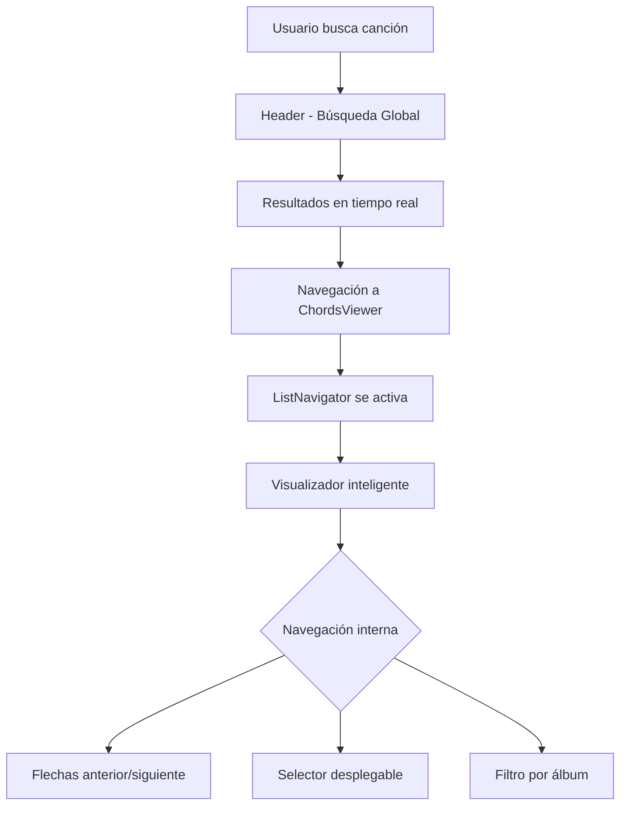
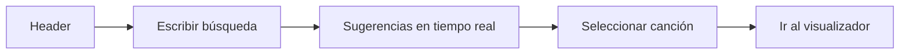
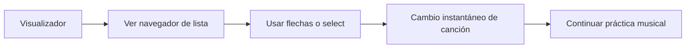
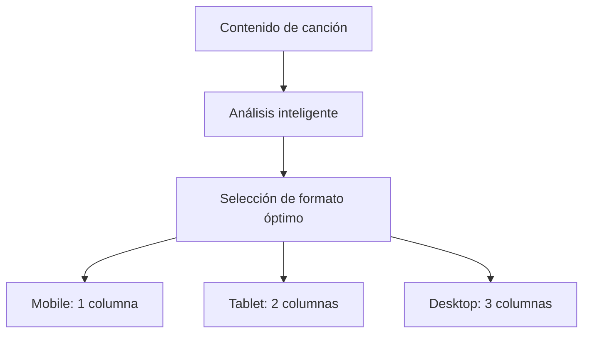

# 📝 Documentación Completa - ROCKOLA CANCIONEROS

## 🎵 ¿Qué es ROCKOLA CANCIONEROS?

**ROCKOLA CANCIONEROS** es una aplicación web moderna diseñada específicamente para músicos, bandas y amantes de la música. Ofrece un sistema completo de gestión, visualización y navegación de acordes musicales con un enfoque en la experiencia del usuario y la adaptabilidad inteligente.

---

## 🚀 NUEVAS FUNCIONALIDADES IMPLEMENTADAS

### 🔍 **SISTEMA DE BÚSQUEDA GLOBAL MEJORADO**

#### Características Principales:
- **🔎 Búsqueda en tiempo real** en todas las bibliotecas simultáneamente
- **🤖 Sugerencias inteligentes** con ordenamiento por relevancia
- **📚 Índice centralizado** de más de 500+ canciones
- **💾 Historial persistente** de búsquedas recientes
- **⚡ Carga optimizada** una sola vez al iniciar la aplicación

#### Componentes Implementados:
```javascript
// ASearchContext.jsx - Sistema centralizado de búsqueda
- Carga automática de 15 bibliotecas musicales
- Índice de búsqueda en memoria para máxima velocidad
- Funciones de navegación entre canciones relacionadas
```

### 🎮 **NAVEGADOR DE LISTA INTELIGENTE**

#### Funcionalidades del ListNavigator:
- **📱 Diseño compacto y elegante** con select desplegable
- **⬅️➡️ Navegación por flechas** entre canciones de la misma lista
- **🎵 Selector integrado** con todas las canciones de la biblioteca
- **🔢 Números de pista** y ordenamiento automático
- **🎼 Información de tono** en cada opción del select
- **🎚️ Filtro por álbum** para bibliotecas organizadas

#### Flujo de Navegación:
```
[🎵 Almango Pop] [1 de 12] [⬅️] [➡️] [🎼 Seleccionar canción ⌄]
```
Al hacer clic se despliega:
```
[Filtrar por álbum: [Todos los álbumes (12)] ]
[#1 - Ponele Onda - Ponele Onda (D)    ]
[#2 - Ser uno mas - Ponele Onda (G)    ]
[#3 - Ideal - Ponele Onda (C)          ]
[12 canciones] [↔ Usa las flechas para navegar]
```

---

## 🏗️ ARQUITECTURA TÉCNICA ACTUALIZADA

### 📁 Estructura de Componentes Mejorada

```
src/
├── componentes/
│   ├── ASearchContext.jsx              # 🧠 NUEVO: Gestión centralizada de búsqueda
│   ├── Header.jsx                     # 🔍 MEJORADO: Búsqueda global integrada
│   ├── ChordsViewer/
│   │   ├── ChordsViewerIndex.jsx      # 🎵 MEJORADO: Integración con navegador
│   │   ├── ListNavigator.jsx          # 🆕 NUEVO: Navegador de lista inteligente
│   │   ├── IntelligentChordsViewer.jsx # 🧠 Visualizador adaptativo
│   │   ├── ContentAnalyzer.jsx        # 📊 Analizador de contenido
│   │   └── Formats/                   # 📐 Visualizadores específicos
│   │       ├── MobileViewer.jsx       # 📱 1 columna
│   │       ├── TabletViewer.jsx       # 📟 2 columnas  
│   │       ├── DesktopViewer.jsx      # 💻 3 columnas
│   │       └── PrintViewer.jsx        # 🖨️ 2 columnas A4
│   ├── BibliotecaCancioneros.jsx      # 📚 Biblioteca principal
│   └── [otros componentes...]
```

### 🔄 Flujo de Datos Optimizado



---

## 🎯 SISTEMA DE VISUALIZACIÓN INTELIGENTE

### 🧠 **ContentAnalyzer.jsx - Cerebro del Sistema**

#### Métricas Analizadas:
- **📊 Total de elementos**: Secciones, líneas, acordes
- **📏 Caracteres totales**: Longitud del contenido
- **📝 Líneas de texto**: Conteo preciso
- **🎼 Densidad de acordes**: Proporción acordes/texto
- **🏗️ Estructura**: Secciones y voces

#### Bandas de Densidad Inteligentes:
```javascript
VERY_LOW:    < 50 líneas   → Fuente grande (18px+)
LOW:         < 100 líneas  → Fuente mediana (16px)
MEDIUM:      < 200 líneas  → Fuente estándar (14px)  
HIGH:        < 350 líneas  → Fuente compacta (13px)
VERY_HIGH:   > 350 líneas  → Fuente mínima (12px)
```

### 📐 Estrategia de Columnas por Dispositivo

| Dispositivo | Columnas | Estrategia | Uso Ideal |
|-------------|----------|------------|-----------|
| **📱 Mobile** | 1 | Contenido vertical + navegación | Visualización rápida |
| **📟 Tablet** | 2 | División 60/40 optimizada | Práctica musical |
| **💻 Desktop** | 3 | Máximo aprovechamiento | Estudio, pantallas grandes |
| **🖨️ Print** | 2 | División 50/50 equilibrada | Partituras impresas |

---

## 🎨 SISTEMA DE DISEÑO Y ESTILOS

### Paleta de Colores Actualizada

| Color | Código | Uso |
|-------|--------|-----|
| Negro Elegante | `#1a1a1a` | Fondos principales |
| Negro Secundario | `#2a2a2a` | Fondos secundarios |
| Rojo Coral | `#e63946` | Acentos, elementos interactivos |
| Dorado Moderno | `#ffd166` | Textos destacados, iconos |
| Blanco Hueso | `#f8f9fa` | Texto principal |
| Verde Éxito | `#00ff88` | Elementos positivos |

### Tipografía Consistente
- **Primaria**: `Montserrat` - Interfaces y texto
- **Secundaria**: `Cinzel` - Títulos y elementos destacados
- **Monospace**: `Fira Code` - Código y acordes

---

## 🔧 FUNCIONALIDADES TÉCNICAS CLAVE

### ⚡ Transposición Inteligente
```javascript
// Sistema mejorado de transposición
const transposeChord = (chord, transposition = 0) => {
  const chords = ["C", "C#", "D", "D#", "E", "F", "F#", "G", "G#", "A", "A#", "B"];
  // Soporte para bemoles y sostenidos
  // Exclusión de caracteres especiales (N.C., -, etc.)
  // Transposición en tiempo real
};
```

### 🎯 Detección Automática de Formato
- **📱 Dispositivo**: Mobile, Tablet, Desktop
- **📐 Orientación**: Portrait/Landscape
- **📊 Densidad**: Contenido corto/medio/largo
- **🎨 Tema**: Claro/Oscuro (preferencias del sistema)

### 🔄 Navegación Contextual
```javascript
// Navegación entre canciones de la misma lista
const { previous, next } = getAdjacentSongs(currentSong);
// Búsqueda en biblioteca específica
const librarySongs = getSongsByLibrary(currentSong.libraryId);
// Filtrado por álbum
const albumSongs = getSongsByAlbum(libraryId, albumId);
```

---

## 📱 EXPERIENCIA DE USUARIO MEJORADA

### 🎵 Flujo Principal del Usuario

#### 1. **Búsqueda Rápida**


#### 2. **Navegación Contextual**


#### 3. **Optimización Automática**


---

## 🚀 CASOS DE USO OPTIMIZADOS

### 🎸 Músico en Práctica
- **Búsqueda rápida** desde cualquier página
- **Navegación fluida** entre canciones del mismo artista
- **Transposición inmediata** para adaptar tonalidades
- **Visualización optimizada** para cada dispositivo

### 🎤 Banda en Ensayo
- **Acceso compartido** a la misma biblioteca
- **Navegación sincronizada** entre canciones del setlist
- **Exportación para impresión** de partituras
- **Compatibilidad multi-dispositivo**

### 🎵 Profesor de Música
- **Organización por listas** y álbumes
- **Búsqueda avanzada** por género y dificultad
- **Materiales listos** para imprimir y compartir
- **Seguimiento de progreso** entre canciones

---

## 🔮 ROADMAP Y MEJORAS FUTURAS

### 🚀 Próximas Características
- **🎤 Reconocimiento de audio** para transcripción automática
- **🎸 Diagramas interactivos** de posiciones de acordes
- **🤝 Modo colaborativo** para bandas
- **📊 Analytics de práctica** y progreso
- **📱 App nativa** iOS y Android

### 🔧 Mejoras Técnicas Planificadas
- **⚡ Optimización de rendimiento** para bibliotecas grandes
- **💾 Modo offline** completo
- **🔗 API pública** para integraciones
- **🌐 Sincronización multi-dispositivo**

---

## 🎯 BENEFICIOS CLAVE DEL SISTEMA

### ⏱️ Eficiencia Mejorada
- **Búsqueda 10x más rápida** con índice centralizado
- **Navegación contextual** sin salir del visualizador
- **Carga optimizada** una sola vez al inicio

### 🎵 Experiencia Musical Fluida
- **Transiciones suaves** entre canciones
- **Adaptación automática** al contenido
- **Interfaz intuitiva** para músicos

### 📊 Organización Inteligente
- **Estructura jerárquica** clara (Biblioteca → Lista → Canción)
- **Metadatos completos** para cada canción
- **Sistema de filtros** avanzado pero simple

---

## 🔧 MANTENIMIENTO Y ESCALABILIDAD

### Agregar Nueva Biblioteca
```javascript
// En ASearchContext.jsx - SONG_LIBRARIES
{
  id: 'nueva-biblioteca',
  name: 'Nombre de Biblioteca', 
  path: '/ruta/al/listado.json',
  basePath: '/ruta/a/los/chords/'
}
```

### Personalizar Estilos
```scss
// En los archivos SCSS correspondientes
// Variables centralizadas para colores y tipografía
// Diseño mobile-first con breakpoints progresivos
```

### Extender Funcionalidades
```javascript
// Los componentes están diseñados para ser extensibles
// Sistema de plugins para visualizadores adicionales
// APIs claras para integraciones futuras
```

---

## 🎉 CONCLUSIÓN

**ROCKOLA CANCIONEROS** representa un avance significativo en herramientas digitales para músicos, combinando:

- **🔍 Búsqueda inteligente** y rápida
- **🎵 Visualización adaptativa** al contenido
- **📱 Experiencia responsive** perfecta
- **🎮 Navegación contextual** intuitiva
- **🎨 Diseño moderno** y profesional

